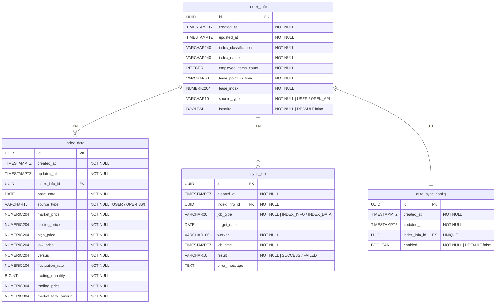

# Findex ERD

## 다이어그램

---

## 엔티티 상세

### index_info — 지수 정보

| 컬럼 | 타입 | 제약 | 설명 |
|---|---|---|---|
| `id` | UUID | PK | 지수 정보 식별자 |
| `created_at` | TIMESTAMPTZ | NOT NULL | 생성 시각 |
| `updated_at` | TIMESTAMPTZ | NOT NULL | 수정 시각 |
| `index_classification` | VARCHAR(240) | NOT NULL | 지수 분류명 (예: 주가지수) |
| `index_name` | VARCHAR(240) | NOT NULL | 지수명 (예: KOSPI) |
| `employed_items_count` | INTEGER | NOT NULL | 채용 종목 수 |
| `base_point_in_time` | VARCHAR(50) | NOT NULL | 기준 시점 |
| `base_index` | NUMERIC(20,4) | NOT NULL | 기준 지수 |
| `source_type` | VARCHAR(10) | NOT NULL | `USER` / `OPEN_API` |
| `favorite` | BOOLEAN | NOT NULL, DEFAULT false | 즐겨찾기 여부 |

- **유니크 제약**: `(index_classification, index_name)`

---

### index_data — 지수 데이터 (OHLCV)

| 컬럼 | 타입 | 제약 | 설명 |
|---|---|---|---|
| `id` | UUID | PK | 지수 데이터 식별자 |
| `created_at` | TIMESTAMPTZ | NOT NULL | 생성 시각 |
| `updated_at` | TIMESTAMPTZ | NOT NULL | 수정 시각 |
| `index_info_id` | UUID | FK → index_info, NOT NULL | 참조 지수 |
| `base_date` | DATE | NOT NULL | 기준 날짜 |
| `source_type` | VARCHAR(10) | NOT NULL | `USER` / `OPEN_API` |
| `market_price` | NUMERIC(20,4) | NOT NULL | 시가 |
| `closing_price` | NUMERIC(20,4) | NOT NULL | 종가 |
| `high_price` | NUMERIC(20,4) | NOT NULL | 고가 |
| `low_price` | NUMERIC(20,4) | NOT NULL | 저가 |
| `versus` | NUMERIC(20,4) | NOT NULL | 전일 대비 등락 |
| `fluctuation_rate` | NUMERIC(10,4) | NOT NULL | 등락률 (%) |
| `trading_quantity` | BIGINT | NOT NULL | 거래량 |
| `trading_price` | NUMERIC(30,4) | NOT NULL | 거래 대금 |
| `market_total_amount` | NUMERIC(30,4) | NOT NULL | 시가 총액 |

- **유니크 제약**: `(index_info_id, base_date)`
- **ON DELETE**: CASCADE

---

### sync_job — 연동 작업 이력

| 컬럼 | 타입 | 제약 | 설명 |
|---|---|---|---|
| `id` | UUID | PK | 작업 이력 식별자 |
| `created_at` | TIMESTAMPTZ | NOT NULL | 생성 시각 |
| `index_info_id` | UUID | FK → index_info, NOT NULL | 연동 대상 지수 |
| `job_type` | VARCHAR(20) | NOT NULL | `INDEX_INFO` / `INDEX_DATA` |
| `target_date` | DATE | | 연동 대상 날짜 |
| `worker` | VARCHAR(100) | NOT NULL | 요청자 IP 또는 `"system"` |
| `job_time` | TIMESTAMPTZ | NOT NULL | 작업 실행 시각 |
| `result` | VARCHAR(10) | NOT NULL | `SUCCESS` / `FAILED` |
| `error_message` | TEXT | nullable | FAILED 시 예외 메시지 |

---

### auto_sync_config — 자동 연동 설정

| 컬럼 | 타입 | 제약 | 설명 |
|---|---|---|---|
| `id` | UUID | PK | 설정 식별자 |
| `created_at` | TIMESTAMPTZ | NOT NULL | 생성 시각 |
| `updated_at` | TIMESTAMPTZ | NOT NULL | 수정 시각 |
| `index_info_id` | UUID | FK → index_info, UNIQUE | 참조 지수 (1:1) |
| `enabled` | BOOLEAN | NOT NULL, DEFAULT false | 자동 연동 활성화 여부 |

- **ON DELETE**: CASCADE

---

## 관계 요약

| 관계 | 설명 |
|---|---|
| `index_info` 1:N `index_data` | 하나의 지수는 여러 날짜의 OHLCV 데이터를 가짐 |
| `index_info` 1:N `sync_job` | 하나의 지수에 대해 여러 번의 연동 작업 이력이 남음 |
| `index_info` 1:1 `auto_sync_config` | 각 지수마다 자동 연동 활성화 여부 설정 1건 존재 |

---

## Enum 타입 정의

### SourceType

| 값 | 설명 |
|---|---|
| `USER` | 사용자가 직접 등록한 데이터 |
| `OPEN_API` | 공공데이터포털 Open API를 통해 배치 수집된 데이터 |

> `index_info`와 `index_data` 양쪽에 존재합니다.

### JobType

| 값 | 설명 |
|---|---|
| `INDEX_INFO` | 지수 정보 연동 작업 |
| `INDEX_DATA` | 지수 데이터 연동 작업 |

### JobResult

| 값 | 설명 |
|---|---|
| `SUCCESS` | 연동 성공 |
| `FAILED` | 연동 실패 (`error_message`에 예외 내용 저장) |